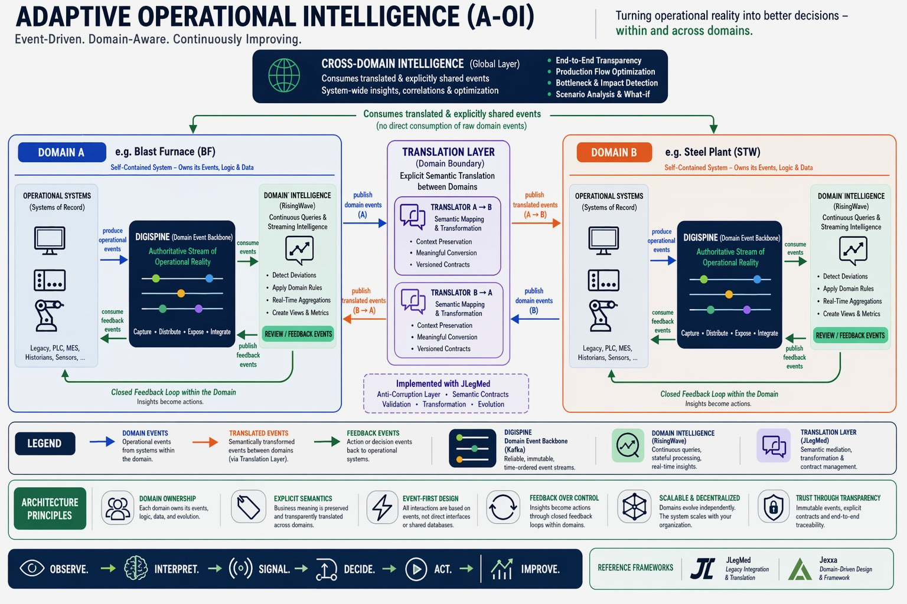

# DigiSpine
*A domain-driven event backbone for operational communication and real-time intelligence.*

---

## Overview

DigiSpine is a structural approach to building **event-native, domain-aligned, and long-lived systems** in complex, legacy-heavy environments.

It implements the **Reality Layer** of the Adaptive Operational Intelligence (A-OI) architecture by representing operations as **authoritative streams of domain events**.

Instead of centralizing data and logic, DigiSpine enables:

- Continuous observation of operational reality
- Loose coupling between systems
- Real-time data flow within and across domains



---

## Key Idea

> DigiSpine does not centralize reality — it makes domain-specific reality observable through events.

Each domain remains autonomous, while integration emerges through **explicit semantic translation and controlled event exchange**.

---

## Why DigiSpine?

Industrial environments typically consist of:

- Legacy systems (PLCs, MES, LIMS, historians)
- Domain-specific applications
- Data silos and tight integrations

Traditional approaches try to unify this complexity into central systems.

**Result:**

- Loss of domain semantics
- High-integration effort
- Limited flexibility

---

# DigiSpine Approach

DigiSpine replaces centralized integration with:

- **Self-contained domain systems**
- **Event-based communication**
- **Explicit domain boundaries**
- **Semantic translation between domains**

---

## Core Concepts

### Self-Contained Systems (SCS)

Each domain operates its own DigiSpine:

- Captures events from operational systems
- Distributes them within the domain
- Exposes them for controlled consumption


```mermaid
graph TD

subgraph Global ["<b>DIGISPINE ARCHITECTURE OVERVIEW - Within a Domain</b>"]
direction TB

%% Der horizontale Backbone über allem
  DS{{"<b>EVENT BACKBONE</b> \n (Centralized Event Streams)"}}

%% Styling für den Backbone
  style DS fill:#ffcc00,stroke:#333,stroke-width:3px,color:#000

%% SCS A
  subgraph SCSA ["SCS A (Microservice)"]
    direction TB
    UIA["UI"]:::fixedSize
    BKA["DDD Backend"]:::fixedSize
    STA[("Storage")]:::fixedSize
    STA <--> BKA <--> UIA
  end

%% Domain B
  subgraph SCSB ["SCS B (Legacy System)"]
    direction TB
    InvisibleB[" "]:::fixedSize
    BKB["Event Recreation"]:::fixedSize
    STB[("Legacy System/DB")]:::fixedSize
    InvisibleB ~~~ BKB
    BKB <--> STB 
  end

%% Domain C
  subgraph SCSC ["SCS C (PLC Access)"]
    direction TB
    BKC["Event Creation <br> (optional)"]:::fixedSize
    PLC["PLC / Sensor Gateway"]:::hardware
    MCH["Machine / Production Line"]:::hardware
    BKC <--> PLC
    PLC <--> MCH
  end
end
%% Verbindungen: Genau eine Verbindung pro SCS zum Backbone
  DS <==> SCSA
  DS <==> SCSB
  DS <==> SCSC

%% Globale Stylings (Orientiert an deinem Bild)

  style UIA fill:#d1e9ff,stroke:#333
  style InvisibleB fill:none,stroke:none,stroke-width:0px,color:#
  style BKA fill:#d5f5e3,stroke:#333
  style BKB fill:#d5f5e3,stroke:#333
  style BKC fill:#d5f5e3,stroke:#333
  
  style STA fill:#fff4e5,stroke:#333
  style STB fill:#fff4e5,stroke:#333
  
````


> DigiSpine represents the **authoritative streams of observable operational reality** within a Domain —not a shared data model.
---

### Event-Based Communication

All interactions are modeled as events:

- Immutable
- Timestamped
- Business-relevant
- Versioned

Event types:

- **Domain Events** → originate from operational systems
- **Translated Events** → semantically transformed across domains
- **Feedback Events** → drive actions back into operations

---

### Domain Ownership

Each domain:

- Owns its data, logic, and event semantics
- Evolves independently
- Defines its own contracts

No global data model is shared across domains.

---

### Real-Time Intelligence

Each domain applies continuous analytics on its event streams using:

- RisingWave (or similar streaming engines)

Capabilities:

- Continuous queries
- Stateful stream processing
- Pattern detection
- Real-time aggregations

> Analytics derive insights — they do not redefine domain semantics.

---

### Feedback-Driven Systems

Insights are fed back into operations via events:

- Trigger actions
- Adjust processes
- Enable continuous improvement

---

## Translation Layer (Domain Boundary)

Cross-domain interaction is handled via an explicit Translation Layer:

- Semantic mapping between domains
- Context-aware transformation
- Versioned contracts

Example:

```mermaid
graph LR
%% Definition der Knoten
A["<b>Domain A \n(Blast Furnace)</b><br>MoltenIronTapped"]
B["<b>Domain B \n(Steel Plant)</b><br>ChargeReady"]
Trans(("<b>TRANSLATION</b>"))

%% Verbindungen (Rechts nach Links)
A --- Trans
Trans --> B

%% Styling für den Translation-Knoten (Größer & Hervorgehoben)
style Trans fill:#f9f,stroke:#333,stroke-width:4px,color:#000

%% Styling für die Domains
style A fill:#f4f4f4,stroke:#666,color:#333
style B fill:#e1f5fe,stroke:#01579b,color:#01579b

```

---


---

## Architectural Rules

- Domains MUST NOT consume raw events from other domains
- Cross-domain interaction MUST go through translation
- Domain semantics MUST originate in the domain
- Analytics MUST NOT redefine domain truth
- Systems MUST be loosely coupled via events

---

## Supporting Frameworks

DigiSpine is supported by complementary frameworks:

- [Jexxa → Domain-driven system architecture](https://github.com/jexxa-projects/Jexxa)

- [JLegMed → Legacy integration & semantic mediation](https://github.com/jexxa-projects/JLegMed)

---

## Technology Perspective

DigiSpine is technology-agnostic, commonly implemented with:

- Apache Kafka → event streaming
- RisingWave → real-time analytics

Technologies are implementation choices — not the architecture itself.

---

## Design Principles

- Event-first architecture
- Domain-driven design
- Explicit semantics
- Feedback over control
- Decentralized intelligence
- Continuous improvement

---

## Philosophy

> Observe. Interpret. Signal. Decide. Act. Improve.

---

## Summary

DigiSpine provides the foundation for:

- Domain-driven integration
- Real-time operational intelligence
- Cross-domain coordination via semantic translation
- Closed-loop, adaptive systems

It replaces:

- Centralized integration
- Shared data models
- Tight system coupling

with:

> **Event-driven, domain-aligned, continuously improving systems**

---

## Status

This repository provides:

- Structural foundation
- Reference architecture
- Integration patterns  
